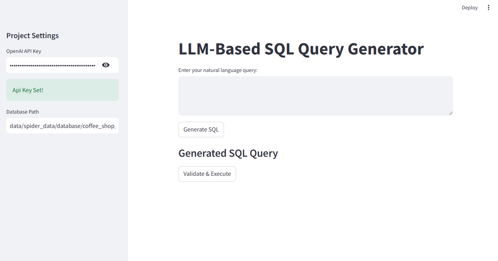

# AI-Powered SQL Query Generator
## Project Description

This project is an intelligent SQL query generation system that converts user-friendly natural language questions into executable SQL queries using a Large Language Model (LLM) such as GPT-4. It allows users to generate, check, and run SQL queries on a given database without needing deep SQL knowledge.

The goal of this application is to make database querying easier, faster, and more accessible through AI assistance.

## Application Interface

## Features

**Natural Language Querying**: Converts plain English questions into SQL using GPT-4.

**SQL Validation**: Checks generated queries for correctness before execution.

**Database Interaction**: Executes queries directly on an SQLite database.

**Schema-Aware Generation**: Produces SQL queries based on the provided database structure.

**Interactive Web Interface**: Built using Streamlit for a clean and simple user experience.

**Secure API Key Handling**: Supports loading the OpenAI API key from a .env file or manual input.

## Technology Stack

**Programming Language**: Python

**AI Model**: OpenAI GPT-4

**Database**: SQLite

**Frontend Framework**: Streamlit

**Supporting Libraries**s: python-dotenv, SQL parsing tools

## 🚀 Setup Instructions
**Step 1: Clone the Repository**
git clone https://github.com/ghaihitasha/llm-sql-query-generator.git
cd llm-sql-query-generator

**Step 2: Install Required Packages**
pip install -r requirements.txt

**Step 3: Configure Environment Variables**

Create a .env file in the project’s root directory and add your OpenAI API key:

OPENAI_API_KEY=your_openai_api_key_here

**Step 4: Launch the Application**
streamlit run src/app.py

## How to Use the Application

Enter your OpenAI API key in the settings section (or allow it to load from .env).

Specify the path to your SQLite database.

Type a natural language query (example: “List all employees hired after 2020”).

Click Generate SQL to view the AI-generated query.

Validate and execute the query to see the output.